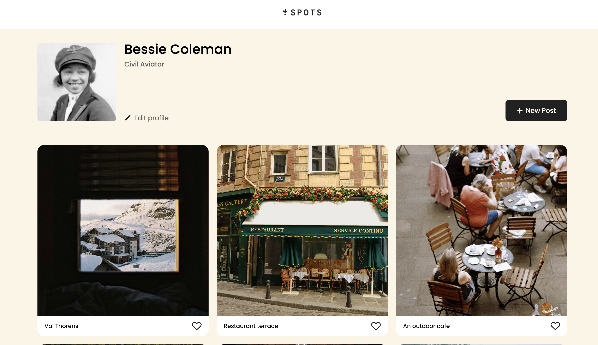
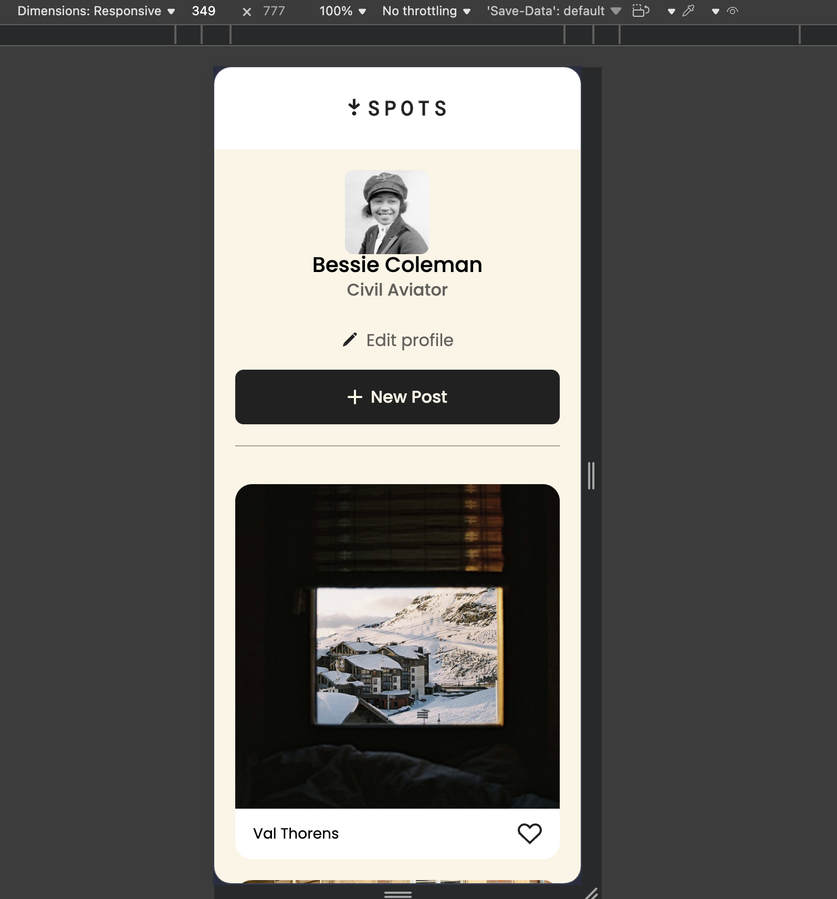

# Spots

## Description

Spots is a responsive image-sharing web application where users can browse a gallery of photo cards, like photos, and view a personal profile. The layout adapts across desktop, tablet, and mobile screen sizes using responsive CSS techniques.

## Functionality

- Profile section with avatar, name, bio, and action buttons
- Photo card grid with like buttons
- Card title text truncates to one line with an ellipsis when too long
- Profile text truncates to three lines with an ellipsis when too long
- Hover states on all interactive buttons
- Responsive layout from 320px mobile up to 1440px+ desktop

## Technologies & Techniques

- HTML5 with semantic markup
- CSS3 — Flexbox, CSS Grid, transitions
- BEM methodology with a flat file structure
- Responsive design with media queries
- CSS Grid for the card layout
- Text overflow handling with `text-overflow: ellipsis` and `-webkit-line-clamp`
- Custom Poppins font loaded via `@font-face`
- Normalize.css for cross-browser consistency

## Screenshots

## Deployed Project

[View live on GitHub Pages](https://godevun.github.io/se_project_spots/)

## Project Pitch Video

[Watch the project pitch video](ADD_LINK_HERE)
